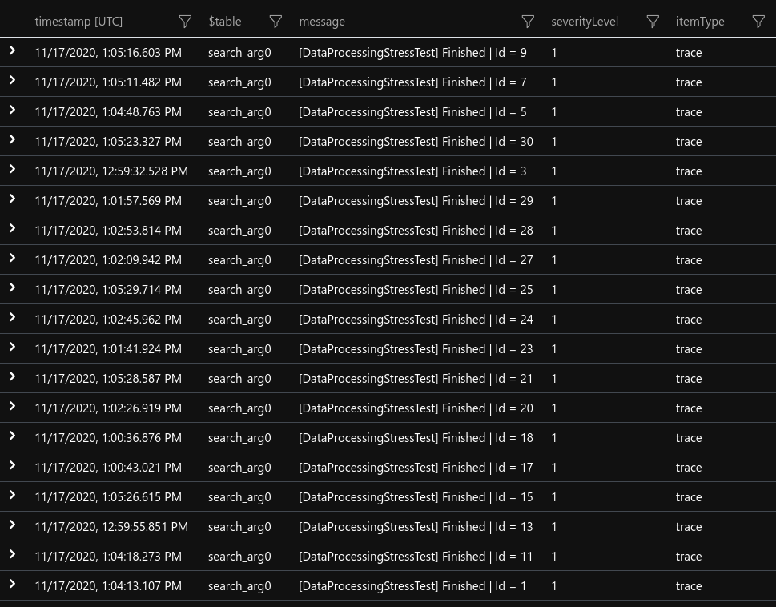

# Data processing stress test

- Implemented 2 function that use `Service Bus`:
   - `DataProcessingStressTestTrigger`
      - Developer should trigger this function using `Service Bus Explorer` and `stress-test-dp-trigger` queue
      - This function triggers N amount of `DataProcessingStressTest` functions with a provided delay using `Service Bus`
      - The whole execution is given a `GUID`
      - Assigns an `Id` to each triggered function `[1 .. N]`
   - `DataProcessingStressTest`
      - Function is triggered by `stress-test-dp`
      - This function simulates data processing
- Added two new service bus queues
   - `stress-test-dp-trigger`
   - `stress-test-dp`
- Data processing is simulated by calculating Nth prime number, writing and deleting files from the disk
- Set `AZURE_FUNCTIONS_ENVIRONMENT` to `Development` for running on local machine or `TEST` for running in Azure
- Populate `local.settings.json` with valid strings
- Azure services needed:
  - `Service Bus Namespace`
    - 2 queues: `stress-test-dp-trigger` and `tress-test-dp`
  - `Function App`
  - `Elastic Premium plan`
  - `Application Insights`
  - `Storage account`

# Example:
Run 30 processes, start next process 2 seconds after previous.
Each process should run for about 900 seconds (15 minutes) before it finishes.
Process repeats these steps for 900 seconds:
  1) Writes 50MB file to the disk
  2) Calculates 1.000.000th prime number
  3) Deletes file on the disk

Using `Service Bus Explorer` send `JSON` to `stress-test-dp-trigger`
```json
{
    "ProcessCount": 30,
    "DelaySeconds": 2,
    "DurationSeconds": 900,
    "FileSizeInMb": 50,
    "PrimeNumberCount": 1000000
}
```

 

# Application insights log queries

- #### 1. Returns all stress test logs
```
traces
| union exceptions
| where customDimensions["DataProcessingStressTest"] == true
| order by timestamp
```

- #### 2. Returns all stress test functions that finished for execution with guid `67fe21a3-7f0c-4151-9fde-f07d7073ff9d`
```
traces
| union exceptions
| where customDimensions["DataProcessingStressTestExecutionGuid"] == "67fe21a3-7f0c-4151-9fde-f07d7073ff9d"
| search "Finished"
| order by message
```

- #### 3. Returns logs for stress test function with id `12` and execution guid `67fe21a3-7f0c-4151-9fde-f07d7073ff9d`
```
traces
| union exceptions
| where customDimensions["DataProcessingStressTestExecutionGuid"] == "67fe21a3-7f0c-4151-9fde-f07d7073ff9d"
| where customDimensions["DataProcessingStressTestId"] == 12
| order by timestamp
```

- #### 4. Returns azure process id with stress test function id for execuion guid `67fe21a3-7f0c-4151-9fde-f07d7073ff9d`
```
traces
| where customDimensions["DataProcessingStressTestExecutionGuid"] == "67fe21a3-7f0c-4151-9fde-f07d7073ff9d"
| summarize arg_max(timestamp,customDimensions["ProcessId"]) by tostring(customDimensions["ProcessId"]) , tostring(customDimensions["DataProcessingStressTestId"])
| order by timestamp
```

# Stress test results

- After running 30 processes, starting next process 2 seconds after the previous, on `Elastic Premium (EP1: 1) plan`:
  - 19 finished successfully, 11 crashed

```json
{
    "ProcessCount": 30,
    "DelaySeconds": 2,
    "DurationSeconds": 900,
    "FileSizeInMb": 50,
    "PrimeNumberCount": 1000000
}
```

## Checking Application Insights logs after the whole execution is done:
#### 19 that finished successfully
  - Query number `2` shows which ones finished
   
  - Query number `4` shows on which azure `ProcessId` were functions running
   
   
#### 11 that failed to finish
  - From the query number `4` we can see that functions that were running on `ProcessId == 19452` all stopped running
  - Seven functions stopped `12:44 - 12:46`, other four were running 4 more minutes and stopped at `12:50`
  
  - Using query number `3` we can see what was azure function doing before it stopped
  - #### Example for Id 8 and 12:
  - `DataProcessingStressTestId == 8` stopped few seconds after it started:
  
  - `DataProcessingStressTestId == 12` stopped about 5 minutes after it started:
  
  
## Screenshot from Resource health


  
 
